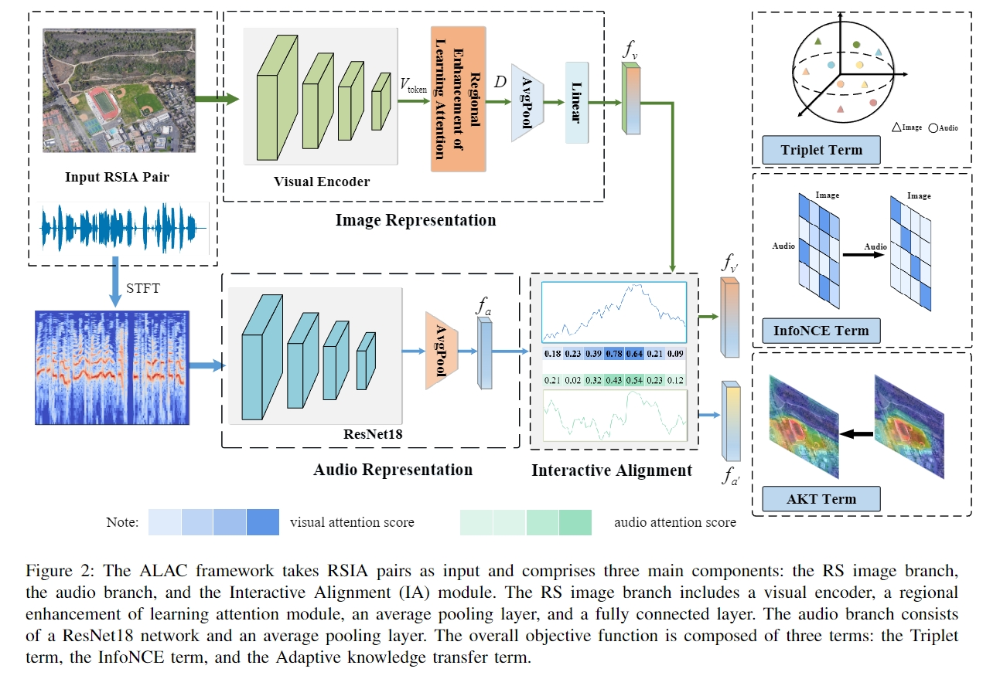

# Cross-Modal Remote Sensing Image-Audio Retrieval with Adaptive Learning for Aligning Correlation

##### Author: Jinghao Huang 

### -------------------------------------------------------------------------------------
### Welcome :+1:_<big>`Fork and Star`</big>_:+1:, then we'll let you know when we update

### -------------------------------------------------------------------------------------

##
## [ALAL](ALAC/README.md)
### Network Architecture

--------------------------
## Environment

Python 3.8.0 
Pytorch 1.11.0  
torchvision 0.12.0
librosa 0.9.1  
numpy 1.21.6
tqdm 4.64.0

--------------------------
## Dataset
We use the following 4 datasets: Sydney Image-Audio Dataset, UCM Image-Audio Dataset, RSICD Image-Audio Dataset and RSITMD Image-Audio Dataset. [Dataset download link 1](https://github.com/ninghailong/Cross-Modal-Remote-Sensing-Image-Sound-Retrieval) or [Dataset download link 2](https://pan.baidu.com/s/1NdZx1n6tQcpGIEXCaB9hrA?pwd=0jlv)

--------------------------
## Train

We train our model on a single 3090Ti GPU card. To train on different datasets, one needs to modify the configuration file in the code and then use the following training command:

 python train.py 

--------------------------
## Test

 python test.py
